# Quantum Time of Arrival

Undergraduate thesis and notebook calculations in C++11 & Mathematica. Plots are written as CSV plus simple SVG, so no Mathematica,
gnuplot, or any C++ plotting library is required.

## Thesis Summary

This project studies the quantum time-of-arrival problem for a free particle wavefunction.
Because a quantum particle has spatial spread and measurements change the wavefunction,
its arrival at a detector is computed probabilistically rather than as a single classical
trajectory. The thesis first treats time as a forward-directed external parameter and
compares small-detector and random-position detector approximations against the classical
arrival time. It then explores a dynamic, non-directional treatment of time that places time
on more equal footing with position; under the default parameters, this approach produces
arrival-time estimates close to the classical value. You can find teh full thesis inside thesis folder.

## Cpp code

- `physics.cpp`: `psi0(...)` from thesis Eq. 2.18 and `propagator(...)` from
  thesis Eq. 2.24.
- `arrival.cpp`: `small_detector(...)` from thesis Eqs. 3.32-3.37,
  `random_detector(...)` from thesis Eqs. 3.38-3.39, and
  `dynamic_arrival_time(...)` from thesis Eqs. 4.3-4.4.
- `plotting.cpp`: CSV and self-contained SVG output helpers.
- `generation.cpp`: figure recipes, verification summaries, and default thesis
  parameter runs.
- `qtoa.cpp`: command-line entry point.
- `evolved_state(...)`: notebook post-measurement wavefunction recurrence for
  plotting `|psi_n(x,t)|^2`.

## Build

```sh
make
```

## Run

```sh
make run
```

Outputs are written under `./output/`.

## Results

The default run recreates the arrival-time checks for a free particle moving
from `x0=-5` to a detector at `xd=-3` with classical arrival time `t=0.1`. The small-detector
recurrence gives `tbar=0.100793868305` for `n=100` and `delta1=0.005`. Wider detector windows increase approximation error, while the
random-position detector remains close to the small-detector and exact-integral behavior
for narrow windows. The dynamic, non-directional time calculation also stays close to the
classical result, with representative checks around `tbar=0.10051`.

The generated SVG plots below are stored in `output/`; matching CSV data files are generated
beside them and ignored by git.

| | |
| --- | --- |
| 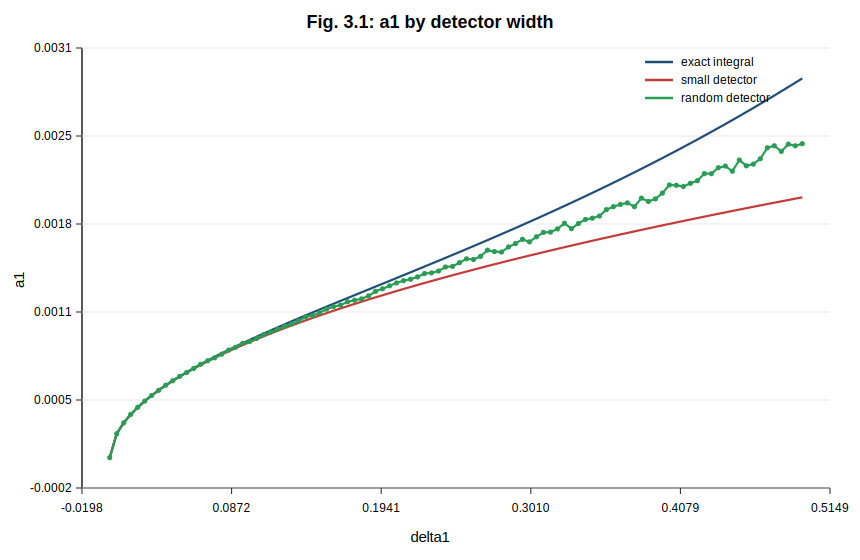 | 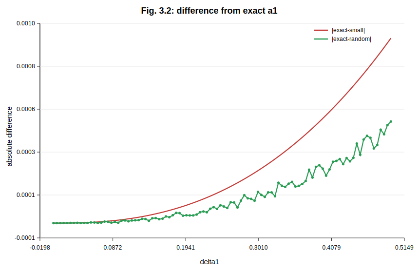 |
| 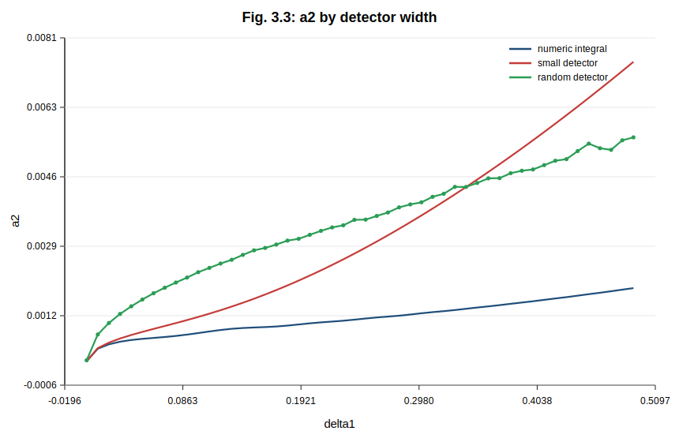 | 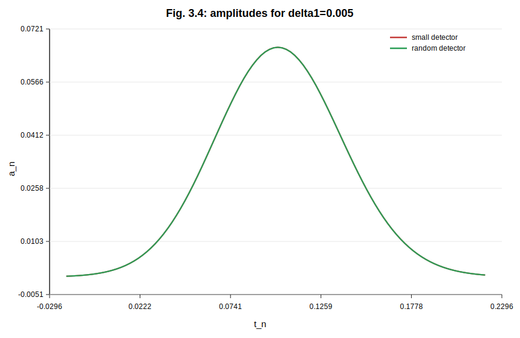 |
| 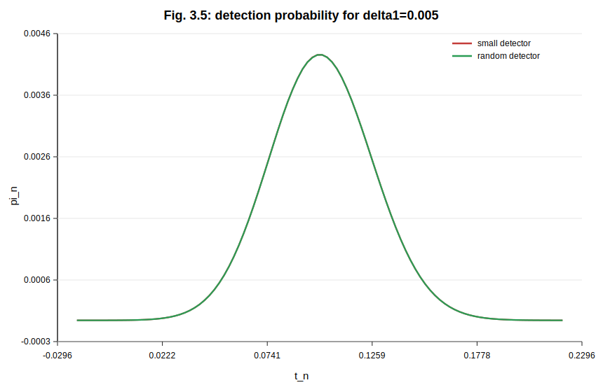 | 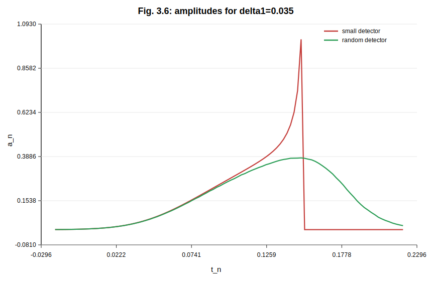 |
| 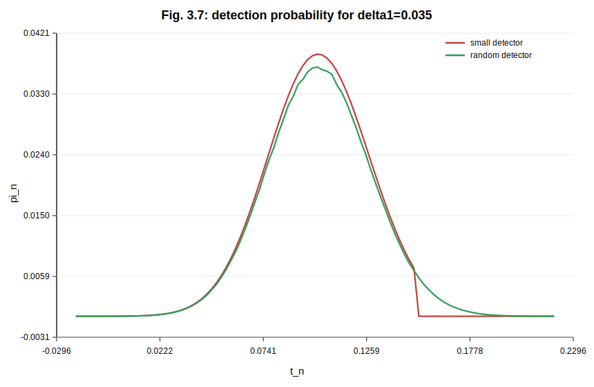 | 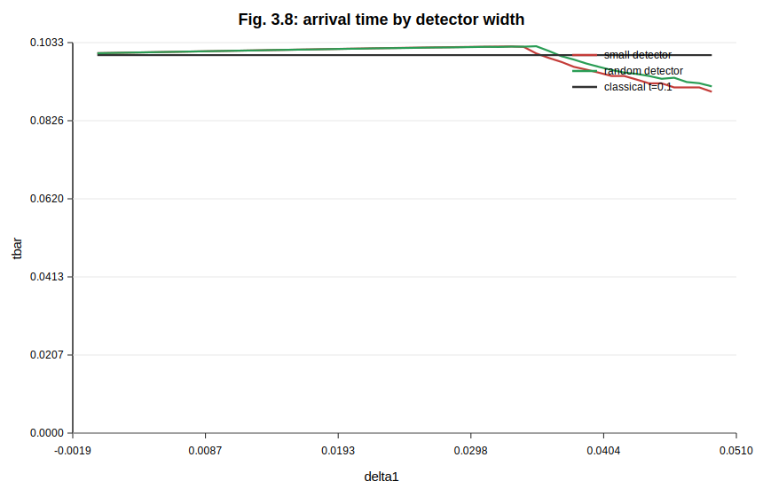 |
| 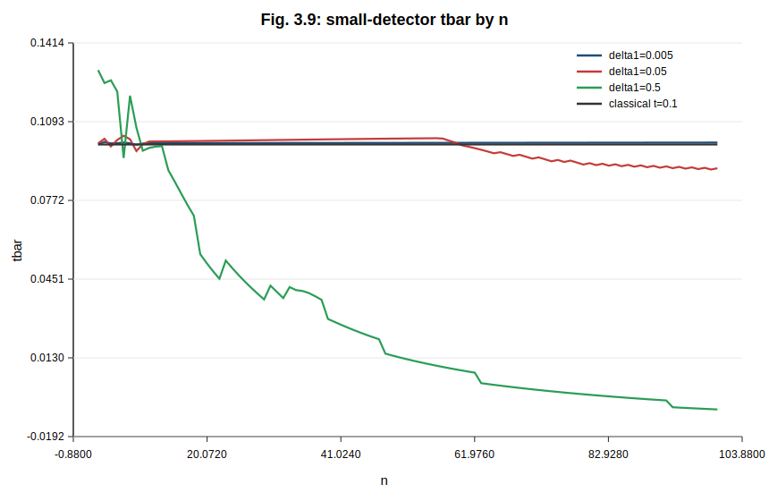 | 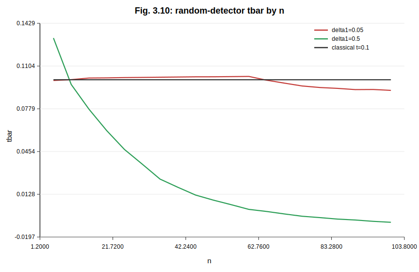 |
| 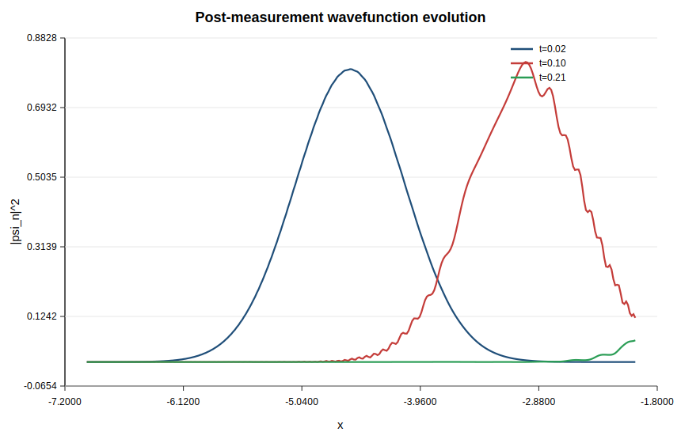 | |


| Wave propagation | Wave detection |
| --- | --- |
| 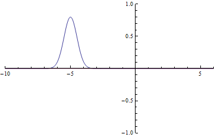 | 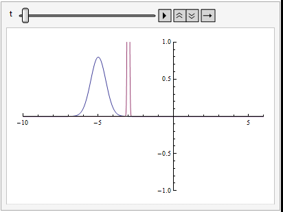 |

